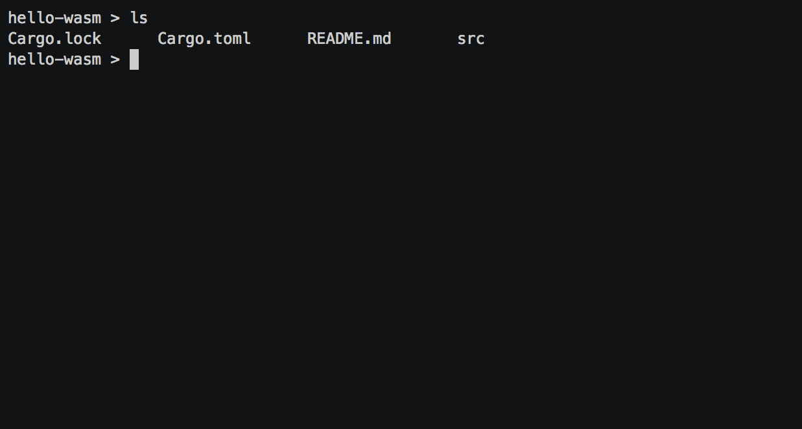

<div align="center">

  <h1>📦✨  wasm-pack</h1>

  <p>
    <strong>Your favorite Rust → Wasm workflow tool!</strong>
  </p>

  <p>
    <a href="https://github.com/rustwasm/wasm-pack/actions/workflows/test.yml"></a>
    <a href="https://crates.io/crates/wasm-pack"></a>
  </p>

  <h3>
    <a href="https://rustwasm.github.io/docs/wasm-pack/">Docs</a>
    <span> | </span>
    <a href="https://github.com/rustwasm/wasm-pack/blob/master/CONTRIBUTING.md">Contributing</a>
    <span> | </span>
    <a href="https://discordapp.com/channels/442252698964721669/443151097398296587">Chat</a>
  </h3>

<sub>Built with 🦀🕸 by <a href="https://rustwasm.github.io/">The Rust and WebAssembly Working Group</a></sub>

</div>

## About

This tool seeks to be a one-stop shop for building and working with rust-
generated WebAssembly that you would like to interop with JavaScript, in the
browser or with Node.js. `wasm-pack` helps you build rust-generated
WebAssembly packages that you could publish to the npm registry, or otherwise use
alongside any javascript packages in workflows that you already use, such as [webpack].

[bundler-support]: https://github.com/rustwasm/team/blob/master/goals/bundler-integration.md#details
[webpack]: https://webpack.js.org/

This project is a part of the [rust-wasm] group. You can find more info by
visiting that repo!

[rust-wasm]: https://github.com/rustwasm/team



## 🔮 Prerequisites

This project requires Rust 1.30.0 or later.

- [Development Environment](https://rustwasm.github.io/wasm-pack/book/prerequisites/index.html)
- [Installation](https://rustwasm.github.io/wasm-pack/installer)

## ⚡ Quickstart Guide

Visit the [quickstart guide] in our documentation.

[quickstart guide]: https://rustwasm.github.io/wasm-pack/book/quickstart.html

## 🎙️ Commands

- [`new`](https://rustwasm.github.io/wasm-pack/book/commands/new.html): Generate a new RustWasm project using a template
- [`build`](https://rustwasm.github.io/wasm-pack/book/commands/build.html): Generate an npm wasm pkg from a rustwasm crate
- [`test`](https://rustwasm.github.io/wasm-pack/book/commands/test.html): Run browser tests
- [`pack` and `publish`](https://rustwasm.github.io/wasm-pack/book/commands/pack-and-publish.html): Create a tarball of your rustwasm pkg and/or publish to a registry

## 📝 Logging

`wasm-pack` uses [`env_logger`] to produce logs when `wasm-pack` runs.

To configure your log level, use the `RUST_LOG` environment variable. For example:

```
RUST_LOG=info wasm-pack build
```

[`env_logger`]: https://crates.io/crates/env_logger

## 👯 Contributing

Read our [guide] on getting up and running for developing `wasm-pack`, and
check out our [contribution policy].

[guide]: https://rustwasm.github.io/wasm-pack/book/contributing.html
[contribution policy]: CONTRIBUTING.md

## 🤹‍♀️ Governance

This project is part of the [rustwasm Working Group].

This project was started by [ashleygwilliams] and is maintained by [drager] and the Rust Wasm Working Group Core Team.

[ashleygwilliams]: https://github.com/ashleygwilliams
[drager]: https://github.com/drager
[rustwasm working group]: https://github.com/rustwasm/team
